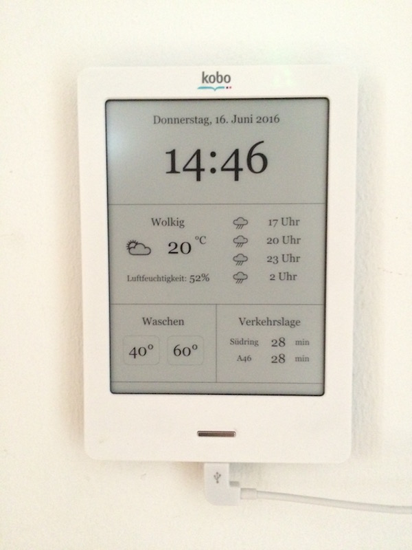

# kobo-display
This project provices a single webpage to display information on an ebook reader like Kindle, Kobo...

## Information provided
* date and time
* current weather and forecast of next hours using **Wunderground** API
* notification to remind me visiting the washing machine in the basement
* commute duration prognosis via different routes using **Google** API

## Technical stack
I used very basic and old school technology to hack the website.

* PHP
* HTML
* CSS with some webkit prefixes
* jQuery

## Preview photo

